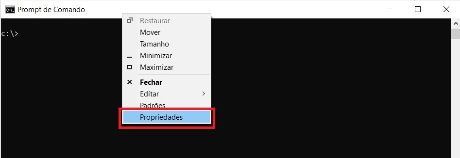
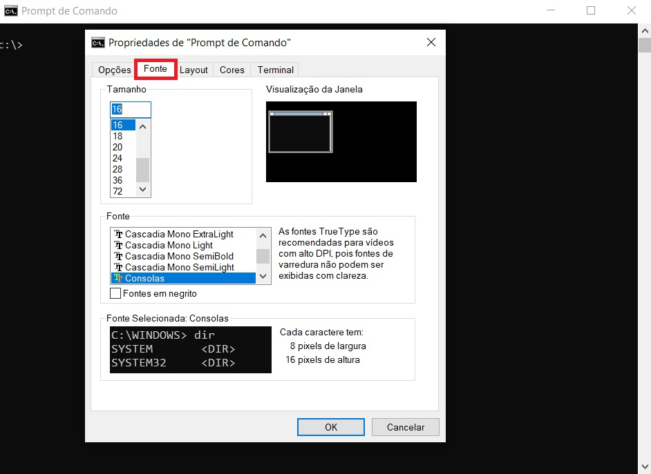
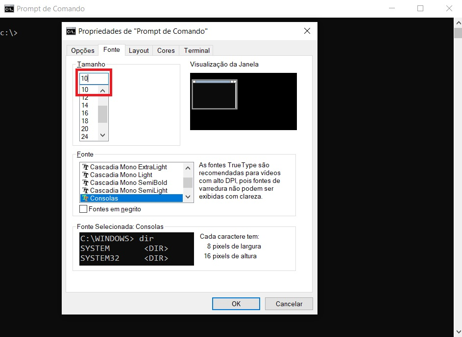
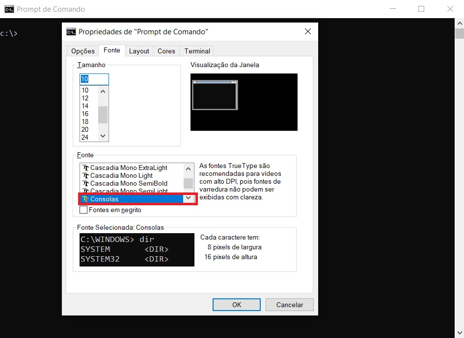
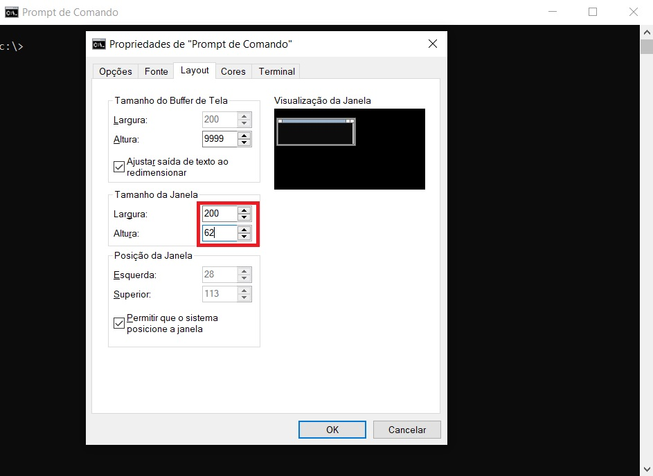

# pyfenstein3d
Projeto realizado em python com intuido educacional de tentar reproduzir o jogo [Wolfenstein 3d](https://pt.wikipedia.org/wiki/Wolfenstein_3D) no prompt de comando.


## Instalação

Para executar o projeto é necessario instalar [python 3](https://www.python.org/downloads/windows/)

Instale [pip](https://pypi.org/project/pip/) utilizando o commando:
```shell
python get-pip.py
```
Execute o comando para realizar a instalação do pyfenstein3d:
```shell
python -m pip install git+https://github.com/GrrriiiM/pyfenstein3d.git@master#egg=pyfenstein3d
```

## Configuração
Devido a performance do prompt cmd, o pyfenstein3d roda em uma resolução de 100x62
Para ter uma visualização ideal do jogo realize as seguintes instruções

1. Clique na barra superior do prompt com o botão direito e selecione __Propriedades__


2. Clique na aba __Fonte__


3. Altere a __Tamanho__ para __10__


4. Altere a __Fonte__ para __Consolas__


5. Clique na aba __Layout__


4. Altere o __Tamanho da Janela__ para __largura 200__ e __altura 62__



## Execução
Após instalação e configuração do prompt, execute o modulo com o comando abaixo
```shel
python -m pyfenstein3d
```

## Commandos
|Comando            | Tecla            |
|-------------------|------------------|
|Andar para frente  | __W__            |
|Andar para trás    | __S__            |
|Andar para esquerda| __A__            |
|Andar para direita | __D__            |
|Virar para esquerda| __Seta esquerda__|
|Virar para direita | __Seta direta__  |
|Abrir porta        | __Espaço__       |