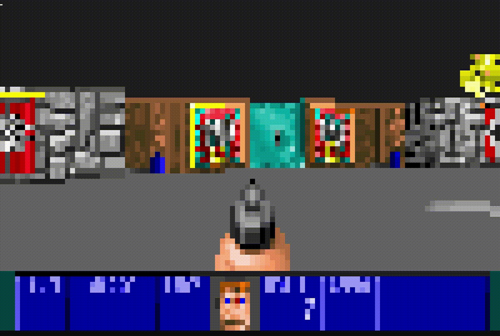

# pyfenstein3d :suspect:
[](https://codecov.io/gh/GrrriiiM/pyfenstein3d)
[](https://opensource.org/licenses/MIT)
[](https://pypi.org/project/pyfenstein3d/)


* [Introdução](#introdução)
* [Instação](#instalação)
* [Execução](#execução)
* [Comandos](#comandos)
* [Implementações Futuras](#implementações-futuras)


## Introdução
Projeto realizado em python com intuito educacional de tentar reproduzir o jogo [Wolfenstein 3d](https://pt.wikipedia.org/wiki/Wolfenstein_3D) no prompt de comando.

Utilizando a fonte __Consolas__, é possivel considerar que cada __2 caracteres__ representem __1 pixel__. E assim "_renderizar_" qualquer imagem no prompt utilizando [ANSI escape code](https://en.wikipedia.org/wiki/ANSI_escape_code) para dar cor.

Para manter o número de quadros por segundo estável, o projeto foi desenvolvido considerando uma renderização de 100x62



## Instalação

Para executar o projeto é necessario instalar [python 3](https://www.python.org/downloads/windows/)

Instale [pip](https://pypi.org/project/pip/) utilizando o commando:
```shell
python -m ensurepip
```

Execute o comando para realizar a instalação do pyfenstein3d:
```shell
python -m pip install pyfenstein3d
```

## Execução
Após instalação e configuração do prompt, execute o modulo com o comando abaixo
```shel
python -m pyfenstein3d
```


## Comandos
|Comando            | Tecla            |
|-------------------|------------------|
|Andar para frente  | __W__            |
|Andar para trás    | __S__            |
|Andar para esquerda| __A__            |
|Andar para direita | __D__            |
|Virar para esquerda| __Seta esquerda__|
|Virar para direita | __Seta direta__  |
|Atirar             | __Seta cima__    |
|Abrir porta        | __Espaço__       |

## Implementações Futuras
- [X] "Renderizar Pixel"
- [x] Raycasting 2d
- [X] Raycasting "3d"
- [X] Textura parede
- [X] Sprites
- [X] Animação
- [X] Portas
- [X] Arma
- [X] Tiro
- [ ] Interação itens
- [ ] Inimigo
- [ ] Inteligencia artificial
