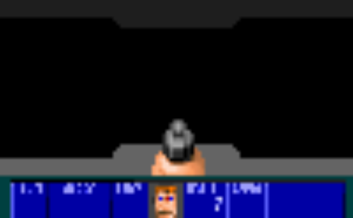
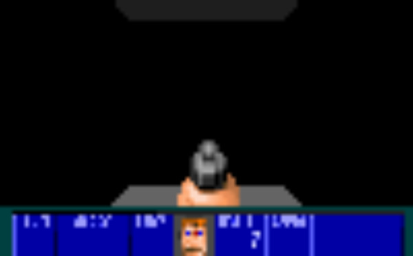
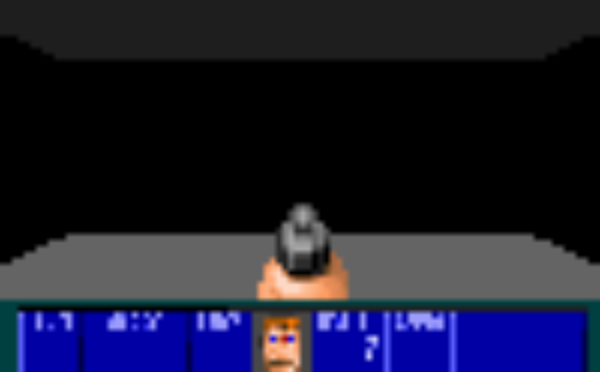
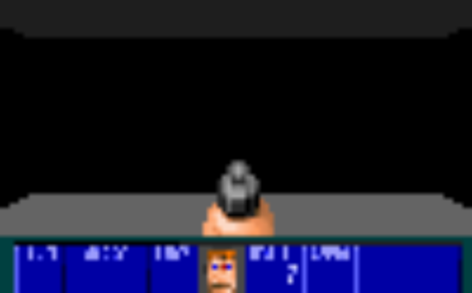
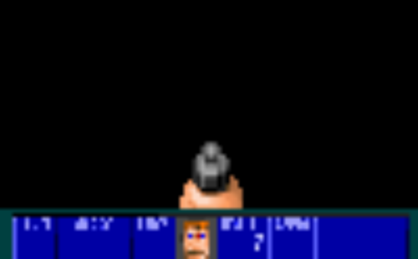
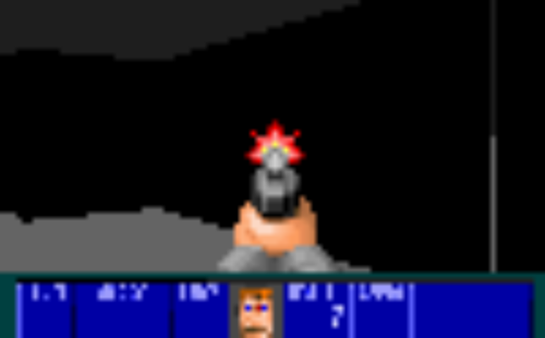
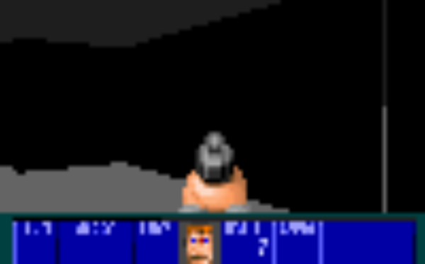
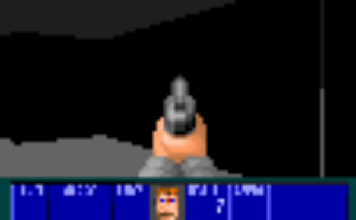
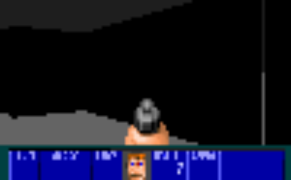
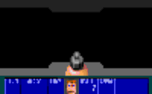

# Pyfenstein3D — Demonstração da Versão Go

Esta página mostra capturas de tela e um GIF animado gerados diretamente pelo motor de jogo escrito em Go, sem depender de um terminal real.

As imagens foram produzidas pelo utilitário [`go/cmd/capture`](../go/cmd/capture/main.go), que inicializa o motor, simula uma sequência de ações do jogador e salva cada quadro como arquivo PNG/GIF.

---

## Tela Inicial

Posição de partida do jogador no mapa `map_1_level_1`.



---

## Andando para Frente

O jogador avança pelo corredor.

| Início do movimento | Meio do trajeto | Final do movimento |
|---|---|---|
|  |  |  |

---

## Virando para a Direita

O jogador gira 90° para a direita, revelando uma nova seção do mapa.

| Início | Durante | Final |
|---|---|---|
|  |  |  |

---

## Avançando pelo Novo Corredor

Após virar, o jogador continua andando para frente.

| Início | Meio | Final |
|---|---|---|
|  |  |  |

---

## Virando para a Esquerda

O jogador vira levemente para a esquerda.

| Início | Final |
|---|---|
|  |  |

---

## Animação de Tiro

Sequência completa da animação da pistola ao atirar.

| Idle | Disparo 1 | Disparo 2 | Disparo 3 | Recuo |
|---|---|---|---|---|
|  |  |  |  |  |

---

## GIF Animado — Percurso Completo

Animação gerada automaticamente com 58 quadros cobrindo todo o percurso acima.



---

## Como Reproduzir

Para gerar novamente as capturas localmente:

```bash
cd go
go run ./cmd/capture/
```

As imagens serão salvas em `docs/captures/`.

Para executar o jogo interativamente (Windows ou terminal com suporte a ANSI):

```bash
cd go
go run .
```
